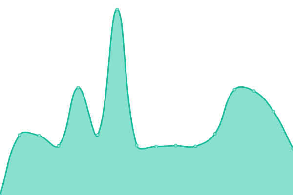

# [📈 Live Status](https://uptime.securityzone.vn): <!--live status--> **🟧 Partial outage**

This repository contains the open-source uptime monitor and status page for [Phạm Minh Khôi](https://uptime.securityzone.vn/), powered by [Upptime](https://github.com/upptime/upptime).

With [Upptime](https://upptime.js.org), you can get your own unlimited and free uptime monitor and status page, powered entirely by a GitHub repository. We use [Issues](https://github.com/pmkdrag0n/upptime/issues) as incident reports, [Actions](https://github.com/pmkdrag0n/upptime/actions) as uptime monitors, and [Pages](https://demo.upptime.js.org) for the status page.

<!--start: status pages-->
<!-- This summary is generated by Upptime (https://github.com/upptime/upptime) -->
<!-- Do not edit this manually, your changes will be overwritten -->
<!-- prettier-ignore -->
| URL | Status | History | Response Time | Uptime |
| --- | ------ | ------- | ------------- | ------ |
|  [Forum Securityzone](https://securityzone.vn) | 🟩 Up | [forum-securityzone.yml](https://github.com/pmkdrag0n/upptime/commits/HEAD/history/forum-securityzone.yml) | 

 2260ms
     
 | 

<a href="https://uptime.securityzone.vn/history/forum-securityzone">85.43%</a>
    

|  [vCenter SI](https://vcenter01.securityzone.vn) | 🟥 Down | [v-center-si.yml](https://github.com/pmkdrag0n/upptime/commits/HEAD/history/v-center-si.yml) | 

 0ms
     
 | 

<a href="https://uptime.securityzone.vn/history/v-center-si">0.00%</a>
    

|  [vCenter POP](https://vcenter02.securityzone.vn) | 🟩 Up | [v-center-pop.yml](https://github.com/pmkdrag0n/upptime/commits/HEAD/history/v-center-pop.yml) | 

 1412ms
     
 | 

<a href="https://uptime.securityzone.vn/history/v-center-pop">55.04%</a>
    

|  [SI Site](https://sivpn.securityzone.vn) | 🟩 Up | [si-site.yml](https://github.com/pmkdrag0n/upptime/commits/HEAD/history/si-site.yml) | 

 1198ms
     
 | 

<a href="https://uptime.securityzone.vn/history/si-site">99.77%</a>
    

|  [POP Site](https://sslvpn.securityzone.vn) | 🟩 Up | [pop-site.yml](https://github.com/pmkdrag0n/upptime/commits/HEAD/history/pop-site.yml) | 

 1194ms
     
 | 

<a href="https://uptime.securityzone.vn/history/pop-site">89.46%</a>
    

|  [Nextcloud](https://nextcloud.securityzone.vn) | 🟩 Up | [nextcloud.yml](https://github.com/pmkdrag0n/upptime/commits/HEAD/history/nextcloud.yml) | 

 1819ms
     
 | 

<a href="https://uptime.securityzone.vn/history/nextcloud">100.00%</a>
    

|  [HNTH Provisioning Server](hnth.securityzone.vn) | 🟩 Up | [hnth-provisioning-server.yml](https://github.com/pmkdrag0n/upptime/commits/HEAD/history/hnth-provisioning-server.yml) | 

 385ms
     
 | 

<a href="https://uptime.securityzone.vn/history/hnth-provisioning-server">87.74%</a>
    

|  [HNTH Service Voice](hnth.securityzone.vn) | 🟩 Up | [hnth-service-voice.yml](https://github.com/pmkdrag0n/upptime/commits/HEAD/history/hnth-service-voice.yml) | 

 212ms
     
 | 

<a href="https://uptime.securityzone.vn/history/hnth-service-voice">87.77%</a>
    

|  [HNTH SIP](hnth.securityzone.vn) | 🟩 Up | [hnth-sip.yml](https://github.com/pmkdrag0n/upptime/commits/HEAD/history/hnth-sip.yml) | 

 212ms
     
 | 

<a href="https://uptime.securityzone.vn/history/hnth-sip">87.85%</a>
    

|  [Project Manager](https://pm.securityzone.vn) | 🟩 Up | [project-manager.yml](https://github.com/pmkdrag0n/upptime/commits/HEAD/history/project-manager.yml) | 

 1546ms
     
 | 

<a href="https://uptime.securityzone.vn/history/project-manager">100.00%</a>
    

<!--end: status pages-->

[**Visit our status website →**](https://demo.upptime.js.org)

## 📄 License

- Powered by: [Upptime](https://github.com/upptime/upptime)
- Code: [MIT](./LICENSE) © [Phạm Minh Khôi](http://pmkhoi.com/)
- Data in the `./history` directory: [Open Database License](https://opendatacommons.org/licenses/odbl/1-0/)
